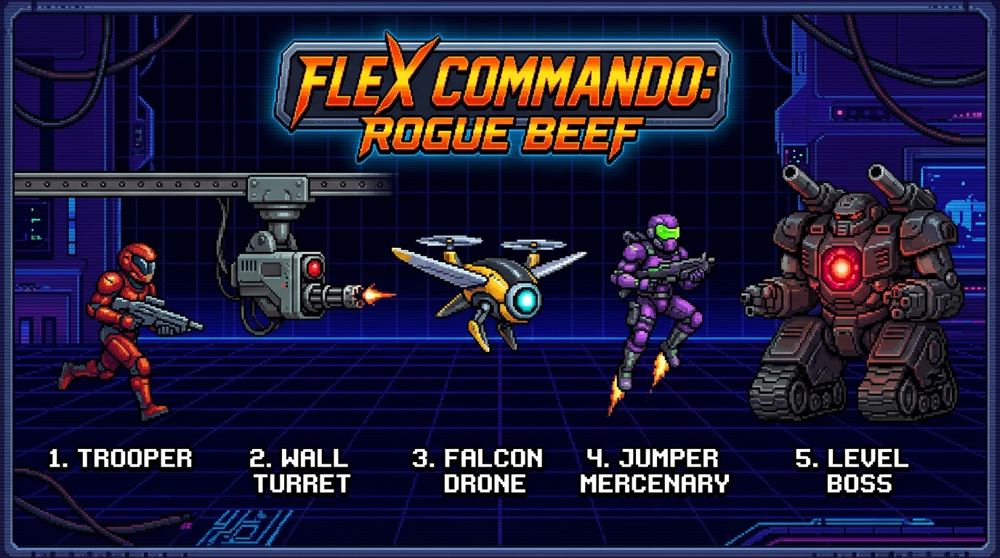
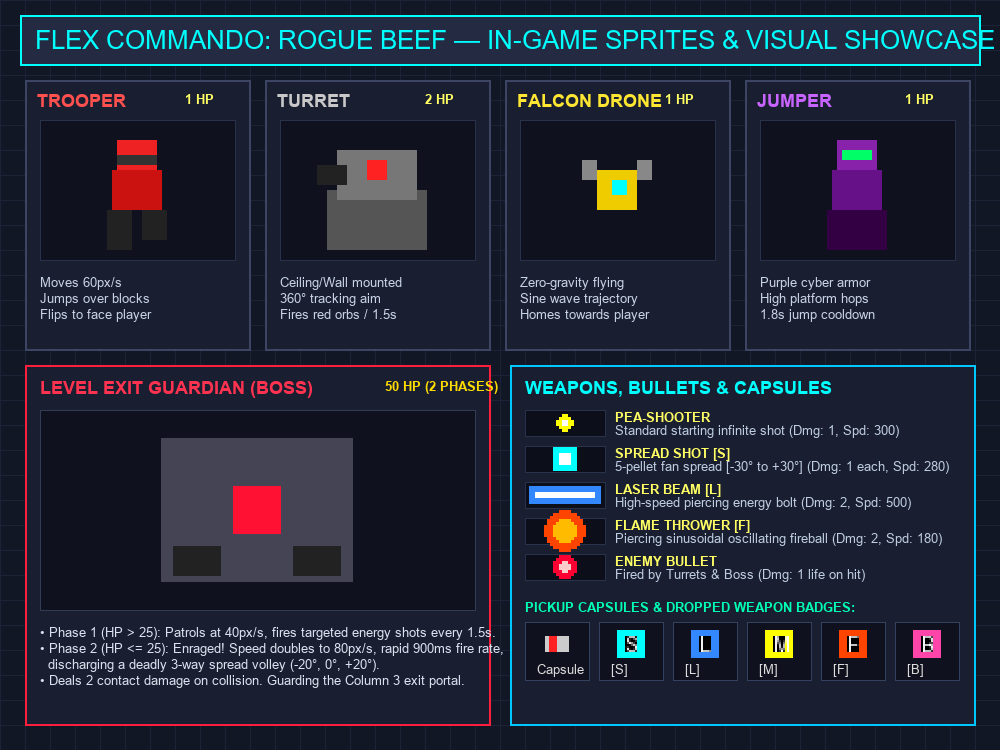
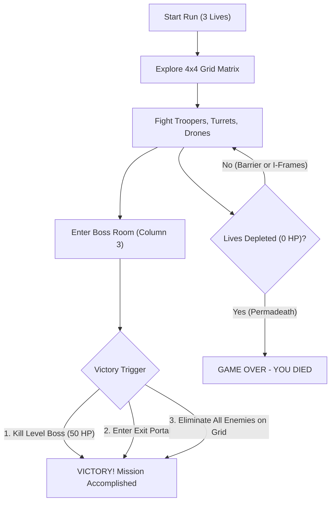

<p align="center">
  
</p>

# Flex Commando: Rogue Beef — Game Manual & Architecture Guide

A comprehensive guide to the concept, enemies, weapons, visuals, and win/loss conditions of **Flex Commando: Rogue Beef**.

---

## 1. Game Concept & Core Philosophy

### Overview
*Flex Commando: Rogue Beef* is an action-packed 2D retro run-and-gun platformer heavily inspired by arcade classics like *Contra*, combined with procedural multi-directional grid room generation reminiscent of *Spelunky* and *Rogue Legacy*.

Players step into the combat boots of an over-the-top 80s action hero—featuring a crimson headband, cobalt tactical vest with chrome harness, high-contrast desert khaki pants, and white wrist wraps—battling through a procedurally generated cybernetic fortress to eliminate hostile robotic forces and conquer the fortress guardian.

### Technical & Design Highlights
* **Native Resolution:** 320×240 pixels (`pixelArt: true`). Each room consists of a 20×15 tile matrix at 16×16px per tile.
* **Procedural 4×4 Grid Layout:** Every run constructs an 80×60 global tilemap (1280×960px world space) containing up to 16 room cells:
  * **Start Room:** Spawns on column 0 (`(0, randY)`).
  * **Boss Room:** Placed on column 3 (`(3, randY)`).
  * **Critical Path:** Carved via a random walk algorithm with backtrack prevention to guarantee a valid route from entrance to exit.
  * **Branch Rooms:** Optional side corridors offering extra weapon capsules and enemy challenges.
  * **Door Bitmask Matching:** Rooms connect dynamically using 4-bit doorway masks (`N=1, S=2, E=4, W=8`) matched to 15 modular room templates.
* **Authentic 16-Bit Graphics & Headless Safety:**
  * **Graphics:** Preloaded 16-bit arcade pixel-art PNG assets located in `public/assets/` (title logo, seamless parallax cyber hangar backdrop, multi-frame enemy sheets, player commando, and neon projectiles) with an automated procedural fallback in `TextureFactory.ts` guaranteeing 100% headless Vitest test execution without HTTP dependencies.
  * **Audio:** 100% synthesized Web Audio API sound effects and chiptune background music (arpeggios, laser blasts, hits, explosions) in `SoundManager.ts`. No audio files required.
* **Seamless Room Camera & Culling:** Smooth pan transitions between rooms; off-screen rooms pause enemy AI and physics to maintain 60 FPS performance.

---

## 2. Visual Showcases

### Enemy Lineup Artwork


### In-Engine Pixel Sprites, Weapons & Pickups


---

## 3. Controls & Mobility

| Action | Input | Details |
|---|---|---|
| **Move Left / Right** | `A` / `D` or `Left` / `Right` Arrow | Moves hero at 120 px/s with run animation. |
| **Aiming** | **Mouse Pointer** (with Crosshair) | Smooth 360-degree aiming tracking the cursor. Fallback to 8-way directional aiming via `W`/`S` keys. |
| **Shoot** | **Left Mouse Button** | Fires equipped weapon (continuous fire supported). |
| **Jump** | `Space`, `W`, or `Up` Arrow | Vaults upward with `-340` jump velocity. |
| **Drop Through Platforms** | `S` / `Down` + `Space` (or Jump) | Disables downward platform collision for 250ms to drop to lower levels. |
| **Mute Audio** | `M` Key | Toggles Web Audio BGM and SFX synthesizer. |
| **Developer Option** | `I` Key (Dev environment only) | Starts run with infinite lives (`∞`). |

---

## 4. Enemy Roster & Behaviors

All enemies extend `EnemyBase` and inherit contact damage, health tracking, and active room camera culling. Defeating regular enemies provides a **20% chance** to drop a weapon upgrade badge.

```
       [Trooper]              [Turret]             [Falcon Drone]
   Red Alien Armor       Ceiling/Wall Mount       Sine-Wave Flier
       (1 HP)                 (2 HP)                  (1 HP)
          │                      │                       │
          ▼                      ▼                       ▼
   Runs & Obstacle        360° Tracking Aim       Smooth Wave Homing
        Jumps               1.5s Red Shots           Flight Path
```

### 1. Trooper (`tex_enemy_trooper`)
* **Appearance:** 16×24 pixel sprite with a 2-frame running animation. Clad in crimson alien combat armor (`#ee2222`), dark tactical visor (`#333333`), red chest plate (`#cc1111`), and charcoal combat boots (`#222222`). Automatically flips horizontally to face the player.
* **HP:** 1 | **Score:** 100 pts | **Contact Damage:** 1 Life
* **Behavior:**
  * Runs horizontally toward the player's X coordinate at 60 px/s.
  * **Obstacle Vaulting:** If grounded and blocked on its side by a wall or tile obstacle, automatically leaps upward (`jumpVelocity = -220`) to clear the obstacle.

### 2. Wall Turret (`tex_enemy_turret`)
* **Appearance:** 24×24 pixel stationary defense emplacement. Composed of an industrial grey mounting plate (`#555555`), metallic barrel mount (`#777777`), central glowing red optic sensor (`#ff2222`), and a heavy dark cannon barrel (`#222222`).
* **HP:** 2 | **Score:** 200 pts | **Contact Damage:** 1 Life
* **Behavior:**
  * Anchored to ceilings and high wall ledges (immovable, zero gravity).
  * Continuously tracks player coordinates in a 360-degree arc using trigonometric aim.
  * When within **300px range**, discharges a red energy orb (`tex_bullet_enemy`) every **1.5 seconds** (1500ms) aimed directly at the player.

### 3. Falcon Drone (`tex_enemy_drone`)
* **Appearance:** 16×16 pixel flying robotic drone with a 2-frame flapping wing animation. Features a bright yellow chassis (`#eecc00`), glowing cyan optical sensor eye (`#00ffff`), and oscillating grey wings (`#888888`).
* **HP:** 1 | **Score:** 150 pts | **Contact Damage:** 1 Life
* **Behavior:**
  * Flies freely with gravity disabled (`allowGravity: false`), pursuing the player horizontally at 40 px/s.
  * Modulates its vertical movement using a mathematical sine/cosine wave trajectory (`amplitude = 15px`, `frequency = 0.003`), swooping up and down smoothly during flight.

### 4. Jumper Mercenary (`tex_enemy_jumper`)
* **Appearance:** 16×24 pixel cybernetic mercenary. Outfitted in purple combat armor plates (`#8822aa` / `#661188`), a luminous neon-green visor (`#00ff66`), and weighted dark purple jump greaves (`#330044`).
* **HP:** 1 | **Score:** 150 pts | **Contact Damage:** 1 Life
* **Behavior:**
  * Moves horizontally toward the player at 50 px/s.
  * Every **1.8 seconds** (1800ms cooldown), executes a high spring jump (`jumpVelocity = -250`) whenever grounded, bounding across multi-tier platforms to ambush the player.

### 5. Level Exit Guardian / Boss (`tex_enemy_boss`)
* **Appearance:** Massive 64×48 pixel heavy war mech tank chassis (hitbox 32×48). Reinforced dark steel battle plating (`#444455`), glowing crimson central reactor core (`#ff1133`), and dual industrial cannons mounted on left and right base flanks (`#222222`).
* **HP:** 50 (tracked on HUD with a 10-segment health bar) | **Score:** 5000 pts | **Contact Damage:** 2 Lives
* **Location:** Guarding the exit portal in the final room on Column 3 (`type === 'BOSS'`).
* **Combat Phases:**
  * **Phase 1 (HP > 25):** Patrols horizontally at 40 px/s (reversing every 2s) while firing targeted energy shots at the player every **1.5 seconds**.
  * **Phase 2 — Enraged (HP ≤ 25):** Health drops below 50%. Movement speed doubles to **80 px/s**, fire rate accelerates to **900 ms**, and attacks upgrade to a deadly **3-way spread volley** (`-20°`, `0°`, `+20°`) aimed at the player.

---

## 5. Arsenal & Pickups

Projectiles are recycled at runtime through `ProjectilePool` to eliminate memory garbage collection spikes during firefights.

| Badge | Weapon Name | Damage | Fire Rate | Speed | Piercing | Behavior |
|:---:|:---|:---:|:---:|:---:|:---:|:---|
| — | **Pea-Shooter** *(Default)* | 1 | 250 ms | 300 | No | Standard starting firearm with infinite ammunition. Fires yellow 6×6 circular bolts (`#ffff00`) with white cores. |
| **[S]** | **Spread Shot** | 1 / pellet | 300 ms | 280 | No | Discharges a **5-pellet fan spread** at `[-30°, -15°, 0°, +15°, +30°]`. Cyan 8×8 square pellets (`#00ffff`). Unmatched crowd control and devastating point-blank burst damage. |
| **[L]** | **Laser Beam** | 2 | 200 ms | 500 | **Yes** | High-velocity 24×6 neon blue beam (`#3388ff`). Cuts completely through multiple enemies in its path without deactivating. |
| **[M]** | **Machine Gun** | 1 | 100 ms | 350 | No | Rapid-fire stream (10 shots per second). Holding down fire maintains a continuous barrage of bullets. |
| **[F]** | **Flame Thrower** | 2 | 200 ms | 180 | **Yes** | 14×14 fiery orb (`#ff4400`). Moves in an undulating **sinusoidal spiral wave** (`Math.sin(...) * 12px`), burning and piercing all targets in its path. |
| **[B]** | **Barrier Shield** | — | — | — | — | Defensive energy bubble. Absorbs up to **3 incoming hits** (`[SHIELD: 3]`) without losing lives, granting 500ms invulnerability per hit. |

### Pickups & Floating Capsules
* **Flying Capsule (`PickupCapsule`):** A silver/red capsule drone that flies across the room in a smooth sine wave (`waveY = sin(t) * 15px`). Shooting it once (1 HP) causes it to drop a floating weapon badge.
* **Weapon Badges (`PickupItem`):** Floating badges labeled `S`, `L`, `M`, `F`, or `B` that gently fall with gravity (`gravityY: 100`, `bounce: 0.4`) and equip immediately when touched.

---

## 6. Winning & Losing Conditions



### Winning State (`VICTORY! MISSION ACCOMPLISHED`)
A run can be successfully won in **three distinct ways**:
1. **Defeating the Level Boss (Primary Objective):** Navigating through the matrix to the final boss chamber on Column 3 and reducing the 50 HP Boss Mech to zero.
2. **Reaching the Exit Portal:** Stepping directly into the glowing green **Exit Portal** located in the boss chamber.
3. **Total Annihilation:** Eliminating every single enemy spawned throughout the entire 4×4 grid level.

When victory occurs, the screen transitions to the Victory Screen displaying `MISSION ACCOMPLISHED` and offering `PRESS SPACE TO RESTART`.

### Losing State (`GAME OVER — YOU DIED`)
* **Lives & Health:** The player begins with **3 Lives** (`❤❤❤` on the HUD).
* **Taking Damage:**
  * If the **Barrier Shield** is active, it absorbs the blow and grants 500ms of invulnerability.
  * Without a shield, sustaining enemy fire or contact damage deducts **1 Life** and grants **1.5 seconds (1500ms) of invulnerability frames** (sprite flashes at 40% alpha).
* **Permadeath:** If lives reach 0, the player dies immediately, transitioning to the Game Over screen (`YOU DIED`). Pressing `SPACE` starts a fresh procedural run with a new random seed.
